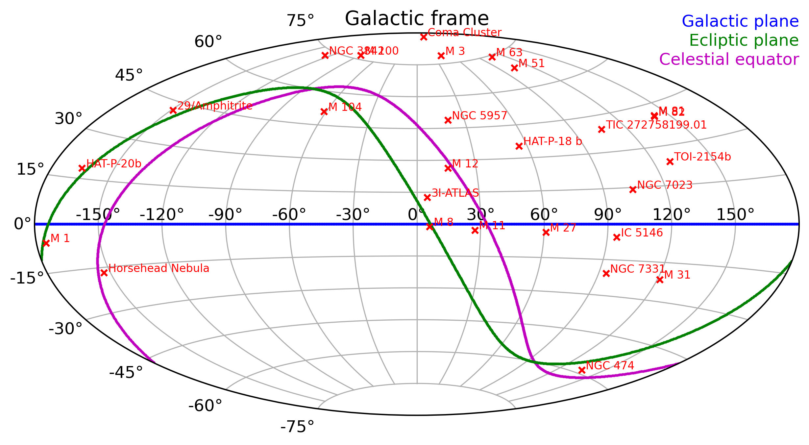

# Astronomy observations - Aurélien Genin

This repository is a summary of all my astronomy observations. It is updated semi-autonomously when the calculation notebook is run after an observation session.

## Observations locations

## Observations statistics

* Total number of observations: 4272
* Total exposure time: 215775s = 59h 56m 15s

| Target           |   Total time (s) |   Observations |   RA (deg) |   DEC (deg) | First                   | Last                    |
|------------------|------------------|----------------|------------|-------------|-------------------------|-------------------------|
| 29/Amphitrite    |          4710.00 |            157 |     141.00 |       19.16 | 2025-03-18T19:00:49.880 | 2025-03-18T20:24:49.222 |
| Coma Cluster     |         15600.00 |            201 |     194.99 |       27.99 | 2025-04-30T22:21:00.212 | 2025-05-01T02:28:03.072 |
| Crab Nebula      |          7200.00 |            260 |      83.63 |       22.01 | 2025-03-02T20:01:21.168 | 2025-03-02T22:20:31.768 |
| HAT-P-20b        |          7080.00 |             59 |     111.92 |       24.34 | 2025-03-07T22:21:52.335 | 2025-03-08T00:25:54.565 |
| Horsehead Nebula |         17960.00 |            715 |      85.27 |       -2.47 | 2025-01-11T18:25:36.421 | 2025-01-12T23:51:53.615 |
| M 3              |         13905.00 |            470 |     205.55 |       28.38 | 2024-03-06T22:52:39.139 | 2025-04-11T02:11:02.803 |
| M 51             |         20730.00 |            261 |     202.48 |       47.20 | 2025-04-04T19:22:36.520 | 2025-04-05T01:50:55.278 |
| M 81             |          7740.00 |             69 |     148.89 |       69.07 | 2025-04-07T19:48:42.938 | 2025-04-07T22:08:00.081 |
| M 82             |          9120.00 |            106 |     148.87 |       69.66 | 2025-04-11T19:14:21.585 | 2025-04-11T21:58:40.280 |
| NGC 3842         |         27990.00 |            668 |     175.99 |       19.95 | 2025-04-02T19:09:00.538 | 2025-04-03T03:56:57.979 |
| NGC 474          |          4620.00 |             86 |      19.92 |        3.39 | 2024-11-09T19:42:23.545 | 2024-11-15T19:53:00.148 |
| NGC 5957         |         30900.00 |            357 |     233.84 |       11.97 | 2025-04-11T22:02:39.208 | 2025-05-02T03:32:17.016 |
| NGC 7331         |         12280.00 |            441 |     339.17 |       34.21 | 2024-10-11T22:34:13.141 | 2024-11-01T22:42:55.848 |
| Sombrero Galaxy  |         10500.00 |            246 |     190.00 |      -11.62 | 2025-05-01T20:59:10.416 | 2025-05-01T23:17:56.664 |
| TIC 272758199.01 |         12960.00 |             72 |     237.32 |       71.44 | 2025-03-18T20:44:42.772 | 2025-03-19T00:24:05.760 |
| TOI-2154b        |         12480.00 |            104 |      71.00 |       84.36 | 2025-03-27T18:51:53.961 | 2025-03-27T22:36:14.906 |

|