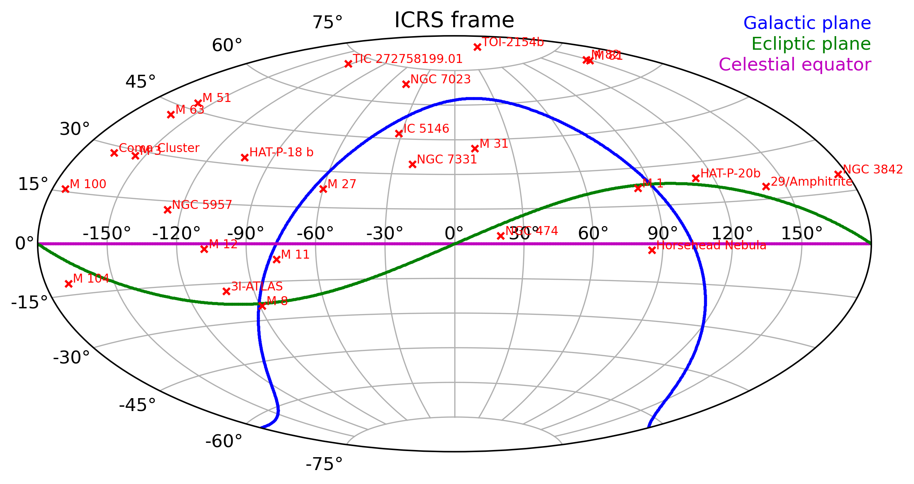

# Astronomy observations - Aurélien Genin

This repository is a summary of all my astronomy observations. It is updated semi-autonomously when the calculation notebook is run after an observation session.

## Observations locations

## Observations statistics

* Total number of observations: 5513
* Total exposure time: 303715s = 84h 21m 55s

| Target           |   Total time (s) |   Observations |   RA (deg) |   DEC (deg) | First      | Last       |
|------------------|------------------|----------------|------------|-------------|------------|------------|
| 29/Amphitrite    |          4710.00 |            157 |     141.00 |       19.16 | 2025-03-18 | 2025-03-18 |
| 3I-ATLAS         |          2580.00 |             16 |     257.74 |      -17.97 | 2025-07-24 | 2025-07-24 |
| Coma Cluster     |         15600.00 |            201 |     194.99 |       27.99 | 2025-04-30 | 2025-05-01 |
| Crab Nebula      |          7200.00 |            260 |      83.63 |       22.01 | 2025-03-02 | 2025-03-02 |
| HAT-P-18 b       |         12960.00 |             72 |     256.35 |       33.01 | 2025-05-16 | 2025-05-16 |
| HAT-P-20b        |          7080.00 |             59 |     111.92 |       24.34 | 2025-03-07 | 2025-03-08 |
| Horsehead Nebula |         17780.00 |            711 |      85.27 |       -2.47 | 2025-01-11 | 2025-01-12 |
| M 100            |          6000.00 |             70 |     185.56 |       15.72 | 2025-05-14 | 2025-05-14 |
| M 12             |          4710.00 |            107 |     251.82 |       -1.93 | 2025-08-11 | 2025-08-11 |
| M 27             |         17070.00 |            433 |     299.90 |       22.72 | 2025-07-09 | 2025-07-10 |
| M 3              |         13485.00 |            459 |     205.55 |       28.38 | 2024-03-06 | 2025-04-11 |
| M 51             |         20730.00 |            261 |     202.48 |       47.20 | 2025-04-04 | 2025-04-05 |
| M 63             |         16980.00 |            181 |     198.95 |       42.03 | 2025-05-14 | 2025-05-15 |
| M 81             |          7740.00 |             69 |     148.89 |       69.07 | 2025-04-07 | 2025-04-07 |
| M 82             |          9000.00 |            105 |     148.87 |       69.66 | 2025-04-11 | 2025-04-11 |
| NGC 3842         |         27930.00 |            667 |     175.99 |       19.95 | 2025-04-02 | 2025-04-03 |
| NGC 474          |          4440.00 |             82 |      19.92 |        3.39 | 2024-11-09 | 2024-11-15 |
| NGC 5957         |         31920.00 |            368 |     233.84 |       11.97 | 2025-04-11 | 2025-05-14 |
| NGC 7023         |         15000.00 |             97 |     315.41 |       68.16 | 2025-07-21 | 2025-07-22 |
| NGC 7331         |         24860.00 |            716 |     339.21 |       34.29 | 2024-10-11 | 2025-07-25 |
| Sombrero Galaxy  |         10500.00 |            246 |     190.00 |      -11.62 | 2025-05-01 | 2025-05-01 |
| TIC 272758199.01 |         12960.00 |             72 |     237.32 |       71.44 | 2025-03-18 | 2025-03-19 |
| TOI-2154b        |         12480.00 |            104 |      71.00 |       84.36 | 2025-03-27 | 2025-03-27 |

